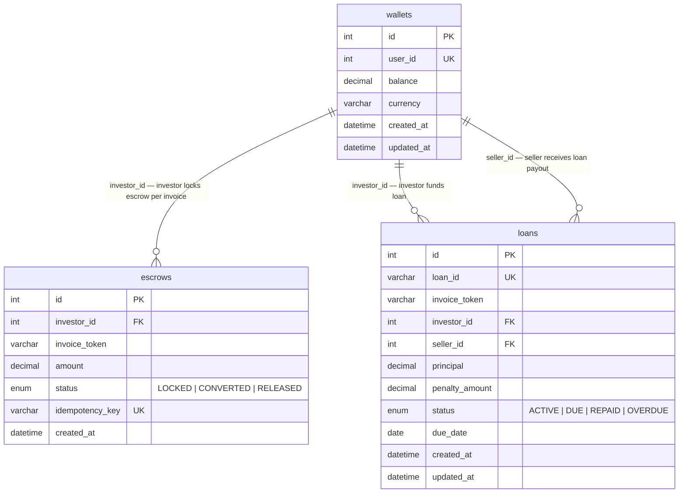

# InvoiceFlow — SOA Layer Diagram

---

## Diagram 1 — Full SOA Layer Diagram (with Databases)

> **Note:** `payment_db` has 3 tables with cross-references. See [Diagram 2](#diagram-2--payment_db-schema) for the full schema breakdown.

```mermaid
flowchart TB
    subgraph USERS["Users"]
        BIZ["Business"]
        INV["Investor"]
    end

    subgraph PRESENTATION["Presentation Layer"]
        FE["React Frontend :3000"]
    end

    subgraph GATEWAY["Gateway Layer"]
        KONG["KONG API Gateway :8000\nJWT · Rate Limit · CORS · Routing"]
    end

    subgraph COMPOSITE["Composite / Orchestration Layer"]
        INV_O["Invoice Orchestrator :5010"]
        BID_O["Bidding Orchestrator :5011"]
        LOAN_O["Loan Orchestrator :5012"]
    end

    subgraph ATOMIC["Atomic Service Layer"]
        USER_S["User Service :5000"]
        INV_S["Invoice Service :5001"]
        MKT_S["Marketplace Service :5002"]
        BID_S["Bidding Service :5003"]
        PAY_S["Payment Service :5004 / gRPC :50051"]
        NOTIF_S["Notification Service :5005"]
        WH_R["Webhook Router :5013"]
        DLQ_M["DLQ Monitor :5014"]
    end

    subgraph WRAPPER["Wrapper / Integration Layer"]
        ACRA_W["ACRA Wrapper :5007"]
        STRIPE_W["Stripe Wrapper :5008"]
        ALB["Activity Log Bridge"]
    end

    subgraph INFRA["Infrastructure / Messaging Layer"]
        RABBIT["RabbitMQ :5672"]
        TEMP_S["Temporal Server :7233"]
        TEMP_W["Temporal Worker"]
        MINIO["MinIO :9000"]
    end

    subgraph DATA["Data Layer"]
        USER_DB[("user_db\nMySQL :3306")]
        INV_DB[("invoice_db\nMySQL :3307")]
        MKT_DB[("market_db\nMySQL :3308")]
        BID_DB[("bidding_db\nMySQL :3309")]
        PAY_DB[("payment_db\nMySQL :3310\n→ See Diagram 2")]
        NOTIF_DB[("notification_db\nMySQL :3311")]
    end

    subgraph EXTERNAL["External Services"]
        STRIPE_EXT["Stripe"]
        DATAGOV["data.gov.sg"]
        RESEND["Resend"]
        OS["OutSystems\nActivity Log"]
    end

    subgraph OBS["Observability"]
        PROM["Prometheus :9090"]
        GRAF["Grafana :3001"]
        LOKI["Loki :3100"]
        TEMPO["Tempo :3200"]
    end

    %% Users → Presentation
    BIZ & INV -->|Browser| FE

    %% Presentation ↔ Gateway
    FE -->|HTTPS| KONG
    NOTIF_S -->|WebSocket| FE
    STRIPE_EXT -->|Webhook| KONG

    %% Gateway → Composites / Services
    KONG -->|REST| INV_O
    KONG -->|REST| BID_O
    KONG -->|REST| LOAN_O
    KONG -->|REST direct| NOTIF_S
    KONG -->|REST| WH_R

    %% Composites → Atomics
    INV_O -->|HTTP| USER_S
    INV_O -->|HTTP| INV_S
    INV_O -->|HTTP| MKT_S
    BID_O -->|HTTP| BID_S
    BID_O -->|HTTP| MKT_S
    BID_O -->|gRPC| PAY_S
    LOAN_O -->|gRPC| PAY_S

    %% Composites → Wrappers
    INV_O -->|HTTP| ACRA_W
    BID_O -->|HTTP| STRIPE_W
    LOAN_O -->|HTTP| STRIPE_W

    %% Composites → Temporal
    INV_O -->|Temporal SDK| TEMP_S
    BID_O -->|Temporal SDK\nstart + signal| TEMP_S
    LOAN_O -->|Temporal SDK| TEMP_S

    %% Temporal internal
    TEMP_W -->|long-poll| TEMP_S

    %% Temporal Worker → Atomics
    TEMP_W -->|HTTP| INV_S
    TEMP_W -->|HTTP| MKT_S
    TEMP_W -->|HTTP| BID_S
    TEMP_W -->|gRPC| PAY_S
    TEMP_W -->|HTTP| USER_S

    %% Publishers → RabbitMQ
    INV_O -->|AMQP publish| RABBIT
    BID_O -->|AMQP publish| RABBIT
    WH_R -->|AMQP publish| RABBIT
    TEMP_W -->|AMQP publish| RABBIT

    %% RabbitMQ → Consumers
    RABBIT -->|AMQP consume| NOTIF_S
    RABBIT -->|AMQP consume| ALB
    RABBIT -->|AMQP consume| BID_O
    RABBIT -->|AMQP consume| LOAN_O
    RABBIT -->|AMQP consume| INV_S
    RABBIT -->|AMQP consume| PAY_S
    RABBIT -->|AMQP consume| USER_S

    %% Wrappers → External
    ACRA_W -->|HTTPS| DATAGOV
    STRIPE_W -->|HTTPS| STRIPE_EXT
    ALB -->|HTTPS| OS
    USER_S -->|HTTPS direct| DATAGOV
    NOTIF_S -->|HTTPS| RESEND

    %% Atomics → Databases
    USER_S --> USER_DB
    INV_S --> INV_DB
    INV_S -->|S3 API| MINIO
    MKT_S --> MKT_DB
    BID_S --> BID_DB
    PAY_S --> PAY_DB
    NOTIF_S --> NOTIF_DB

    %% Observability (dotted — scrapes all layers)
    PROM -.->|scrape metrics| USER_S & INV_S & MKT_S & BID_S & PAY_S & NOTIF_S & WH_R
    PROM -.->|scrape metrics| INV_O & BID_O & LOAN_O
    GRAF -.->|queries| PROM
    LOKI -.->|log aggregation| USER_S & INV_S & MKT_S & BID_S & PAY_S & NOTIF_S
    TEMPO -.->|traces OTLP| USER_S & INV_S & MKT_S & BID_S & PAY_S & NOTIF_S
```

---

## Diagram 2 — payment_db Schema

`payment_db` (MySQL :3310) is owned exclusively by **Payment Service** (:5004 / gRPC :50051).
It has 3 tables with shared foreign keys (`investor_id`, `invoice_token`) across them.

### Table notes

| Table | Purpose |
|-------|---------|
| `wallets` | One wallet per user (SELLER or INVESTOR). Balance updated via gRPC only. |
| `escrows` | Created when investor places a bid. Released immediately on outbid; converted to loan on auction win. `idempotency_key` prevents double-locking on Temporal retries. |
| `loans` | Created by Temporal Worker after auction closes. Tracks repayment lifecycle. `penalty_amount` populated on OVERDUE (5% of principal). |
